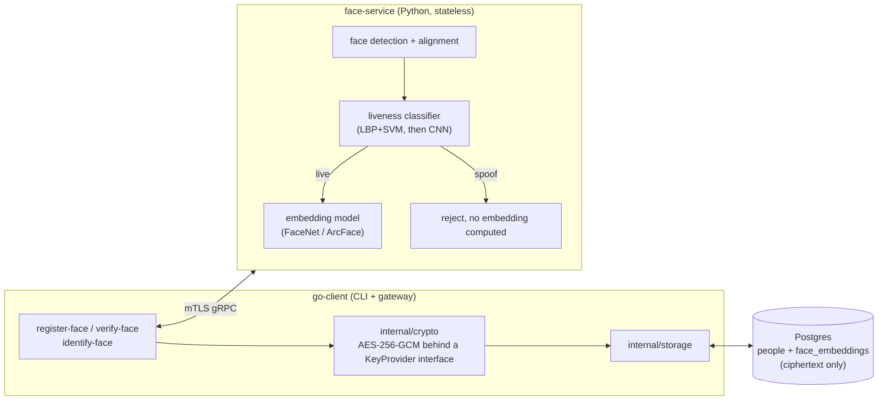

# face-liveness

Face verification that can tell the difference between a live person
and someone trying to get past it with a photo, a printed picture, or a
phone/screen held up to the camera.

## The problem

"Face verification" sounds like one problem. It's two, and they're not
equally hard:

**Face recognition**: is this face the same person as that other face.
A pretrained embedding model turns a detected, aligned face into a
vector, and comparing two faces becomes a cosine similarity check
against a threshold. This part is largely solved territory; there's
integration work here, not much open research.

**Liveness detection** (presentation attack detection, PAD in the
literature): is the thing in front of the camera an actual live human,
not a printed photo, not a screen replaying a video, not a mask. This is
the hard, actively-researched half, and it's the part this project
spends its effort on.

## How the pipeline works

```
capture → detect face → LIVENESS CHECK → (if live) → embedding → compare
                              ↓
                        (if spoof) → reject, recognition never runs
```

Liveness detection gates recognition, not the other way around. A photo
held up to the camera gets rejected before face matching ever sees it.
This ordering is the actual fraud prevention; recognition and liveness
aren't independent features, one blocks the other.

## Architecture



One RPC does detect → liveness check → embedding in a single pass (the
face crop is reused for both the liveness classifier and the embedding
model), returning either a rejection reason or an embedding plus a
liveness confidence score.

Go owns storage, encryption, and orchestration. The Python service is
stateless: it never touches a database, never sees a name or date of
birth, only image bytes and the scores/embeddings it computes from
them. That split is deliberate: it means the matching/liveness models
can be retrained, swapped, or rebenchmarked without touching how
identities are stored, and it means a compromise of the ML service
alone doesn't expose biographic data.

## Metrics

Evaluated on APCER, BPCER, and ACER, not just accuracy:

- **APCER**: attack presentation classification error rate: how often
  a spoof fools the model into thinking it's live. The dangerous
  failure mode.
- **BPCER**: bona fide presentation classification error rate: how
  often a real person gets wrongly rejected. The annoying but safe
  failure mode.
- **ACER**: the average of the two, the headline number.

Accuracy alone hides which of these is happening. A model that always
predicts "live" can post deceptively high accuracy on an imbalanced test
set while its APCER sits at 100%.

## Status

| Milestone                                  | Status             | Notes                                                                                                                                                                                                |
| ------------------------------------------ | ------------------ | ---------------------------------------------------------------------------------------------------------------------------------------------------------------------------------------------------- |
| M1: LBP + SVM baseline                     | done               | single split ACER 0.3300, k-fold ACER 0.1878 +/- 0.0280                                                                                                                                              |
| M2: small CNN from scratch                 | done               | single split ACER 0.2216, k-fold ACER 0.0637 +/- 0.0316; clearly beats M1 on NUAA, but APCER still needs threshold/generalization work                                                               |
| M2b: k-fold cross-validation               | done               | CNN k-fold improves BPCER heavily over M1, but average APCER is still about 10%, see "Cross-validation" below                                                                                        |
| M3: generalization stretch (CelebA-Spoof)  | ready to run       | loader, train script, and evaluator are implemented; needs the local CelebA-Spoof dataset download before training                                                                                   |
| M4: export to ONNX, serve                  | not started        |                                                                                                                                                                                                      |
| M5: Go client + encrypted Postgres storage | not started        |                                                                                                                                                                                                      |
| M6: mTLS between services                  | not started        |                                                                                                                                                                                                      |

Sequenced deliberately: classical technique first, so there's a real
number to compare a neural net against, then a CNN, then a harder
dataset to find out where that CNN's assumptions break.

### A real bug: subject leakage in the original split

The first version of `dataset.py` split at the image level, stratified
by label only. NUAA numbers subjects identically across `ClientFace/`
and `ImposterFace/` (subject `0007`'s live photos and photos of a spoof
attack against them are both under a folder named `0007`), and with
only a few dozen subjects total and thousands of images per subject
across multiple sessions, an image-level split put the same subject's
photos in both train and test.

That let a model partly learn "do I recognize this specific person"
instead of the actual live-vs-spoof texture cue, a shortcut that
doesn't exist at real verification time against someone the model has
never seen. It's why the CNN's validation ACER hit exactly 0.0000: not
a good model, a leaking one.

`dataset.py` now splits by subject, no subject's images appear in more
than one split. NUAA's total subject count is small (low double digits),
so this produces a genuinely small number of test subjects, that's an
honest limitation of the dataset itself, not something to hide by going
back to a split that would report a better-looking, meaningless number.
Both M1 and M2 need to be retrained and re-evaluated against this
corrected split before either result means anything.

### A second real bug: noisy single-split validation

Rerunning M2 on the corrected subject-disjoint split, `train_cnn.py`
selected its best checkpoint at validation ACER 0.0007, epoch 12 of 15.
The same model scored 0.2216 ACER on the real held-out test set, a huge
gap.

With only a handful of subjects in the validation set, val ACER is a
noisy, high-variance number, it swings based on which specific
subject's images happen to be easy or hard that particular epoch, not
purely on genuine model quality. Picking "the single best epoch out of
15" is itself a form of overfitting to that noise: epoch 12 wasn't
necessarily a better model, it may just have been the epoch that got
lucky on a tiny validation set. The test result, not the validation
result, was the trustworthy number.

### Cross-validation

`kfold.py`, `cross_validate_baseline.py`, and `cross_validate_cnn.py`
address this directly with subject-disjoint k-fold cross-validation,
via sklearn's `GroupKFold` (group = subject_id). Every subject serves as
test data in exactly one fold across the k runs, so the whole dataset
gets used for evaluation instead of permanently reserving a slice of an
already-small subject pool as a holdout that never contributes to
training. Reporting mean and standard deviation across folds is a
meaningfully more robust estimate than trusting a single split, and the
standard deviation itself is informative: small means the estimate is
stable, large is an honest signal it still shouldn't be trusted to one
decimal place.

Both CV scripts call `kfold.make_folds` with the same `n_splits`, and
`GroupKFold`'s fold assignment is deterministic for a given input order,
so the two models are evaluated on identical folds without either
script needing to explicitly coordinate with the other.

```
python src/cross_validate_baseline.py
python src/cross_validate_cnn.py
```

`cross_validate_cnn.py` trains a fresh model per fold (5 by default),
expect roughly 5x the runtime of a single `train_cnn.py` run.

Current NUAA 5-fold results:

| Model         | ACER              | APCER             | BPCER             |
| ------------- | ----------------- | ----------------- | ----------------- |
| LBP + SVM     | 0.1878 +/- 0.0280 | 0.1031 +/- 0.0919 | 0.2725 +/- 0.0851 |
| CNN from zero | 0.0637 +/- 0.0316 | 0.1013 +/- 0.0720 | 0.0261 +/- 0.0293 |

The CNN is the better NUAA model by ACER and BPCER, but it has not
solved the security side of the problem yet: average APCER is still
about 10%, and fold 5 reached 0.2289 APCER. That means the next ML step
is threshold tuning and a broader generalization test, not service
deployment.

## Getting started

This project is pinned to Python 3.12. The repo includes a
`.python-version` for pyenv, and the commands below create an isolated
venv so the scripts do not accidentally run against a system Python
with missing or mismatched scientific packages.

### M1: LBP + SVM baseline

```
cd ml
python3.12 -m venv .venv
source .venv/bin/activate
python -m pip install -r requirements.txt
```

Get the dataset first, see `ml/data/README.md` for which of the three
available formats to use.

```
python src/train_baseline.py
python src/evaluate.py
```

`train_baseline.py` writes the exact train/val/test split it used to
`ml/models/split.json`. `evaluate.py` reads that back instead of
recomputing its own split, so the reported numbers are guaranteed to be
against data the model never saw during training. If it recomputed the
split independently, a later change to the splitting logic could
silently produce a different held-out set than the one training
actually used, and the reported numbers would be meaningless without
anyone noticing.

### M2: CNN trained from scratch

Same split as M1, `train_cnn.py` reads `ml/models/split.json` directly
rather than computing its own, so the comparison against M1's numbers
is on identical data.

```
python src/train_cnn.py
python src/evaluate_cnn.py
```

`train_cnn.py` selects the best checkpoint by validation ACER, not
validation loss, loss is what the optimizer minimizes but it isn't the
number this project reports, the lowest-loss checkpoint and the
lowest-ACER checkpoint aren't guaranteed to be the same epoch.

`evaluate_cnn.py` defaults to a 0.5 live-score threshold. To see how a
stricter gate changes spoof acceptance and live-user rejection, sweep
thresholds on the saved validation/test split:

```
python src/sweep_cnn_threshold.py
python src/sweep_cnn_threshold.py --max-apcer 0.05
```

The script selects a threshold using validation metrics first, then
reports that same threshold on the held-out test split. Picking a
threshold directly from test metrics would overfit the test set and
make the result look better than it really is. Because NUAA has so few
subjects, this threshold sweep is diagnostic rather than final policy;
the chosen gate still needs to be checked on broader data.

### Local liveness inference

`liveness.py` is the integration boundary for the ML side. It loads
either the baseline or CNN artifacts from `ml/models/` and returns the
single decision the future service/client needs: whether the liveness
gate passes and recognition is allowed to continue.

```
python src/predict_liveness.py path/to/face.jpg --model cnn
python src/predict_liveness.py path/to/face.jpg --model baseline
```

The input is expected to be an already-cropped face image. Full-frame
face detection/alignment and embedding generation are still future
service work; this command only integrates the trained PAD models into
a reusable inference path.

### M3: CelebA-Spoof generalization

CelebA-Spoof is the next dataset because NUAA is too small and narrow to
justify service work by itself. The loader expects the official
CelebA-Spoof JSON annotation format, where annotation index `40` is the
spoof type (`0` = live, non-zero = spoof media). The project converts
that to its internal binary convention: live = `1`, spoof = `0`.

Place the dataset under:

```
ml/data/celeba_spoof/
```

To download from the official Google Drive folder linked by the
CelebA-Spoof authors:

```
python src/download_celeba_spoof.py --i-accept-non-commercial-research-terms
```

The acknowledgement flag is deliberate. CelebA-Spoof is distributed for
non-commercial research/education use, so the script makes the dataset
agreement explicit instead of silently pulling biometric data.

The loader looks for split annotations named like `train_label.json`,
`val_label.json` or `valid_label.json`, and `test_label.json`. Image
paths in the JSON can be direct paths relative to the dataset root or
paths under common layouts such as `Data/<split>/...`.

Train and evaluate the CNN on CelebA-Spoof:

```
python src/train_cnn_celeba.py --epochs 15
python src/evaluate_cnn_celeba.py
```

For a quick local smoke run before the full training job:

```
python src/train_cnn_celeba.py --limit-train 1000 --limit-val 400 --epochs 1
python src/evaluate_cnn_celeba.py --limit 400
```

The CelebA-Spoof result is the decision point before Go/service work:
if the CNN fails to generalize beyond NUAA, serving it would only
productionize a dataset-specific model.

## Datasets

- **[NUAA Photograph Imposter
  Database](https://parnec.nuaa.edu.cn/_upload/tpl/02/db/731/template731/pages/xtan/NUAAImposterDB_download.html)**,
  small, print-attack-only. Direct download via Google Drive, no
  agreement required. Three formats are offered, use the
  face-detector-output one, see `ml/data/README.md` for details. Used
  for M1/M2.
- **[CelebA-Spoof](https://github.com/ZhangYuanhan-AI/CelebA-Spoof)**,
  larger, covers print, replay, and mask attacks. Distributed via
  Google Drive/Baidu links, sometimes behind a request form. Used for
  M3.

## Tech stack

- **Python**: face detection/alignment, liveness classifier
  (scikit-learn for M1, PyTorch for M2+), embedding model, gRPC serving
- **Go**: CLI, storage, encryption, orchestration
- **Postgres**: encrypted face embeddings, kept in a separate table
  from biographic data
- **gRPC + mTLS**: service boundary and transport auth between Go and
  Python

## Out of scope

- **Depth/IR-based liveness.** Commercial PAD systems lean on depth/IR
  cameras precisely because RGB-only liveness detection has real, known
  limits, a good enough printed photo or replayed video can still fool
  a single-image classifier. This project is RGB-only by necessity
  (webcam/phone camera); that limitation is stated here rather than
  papered over.
- **Active liveness** (blink/head-turn challenges). Passive, single-image
  liveness only.
- **Multi-modal fusion** (RGB + depth + IR combined), the realistic way
  commercial systems close the gap a single RGB camera can't, and out of
  reach without that hardware.
