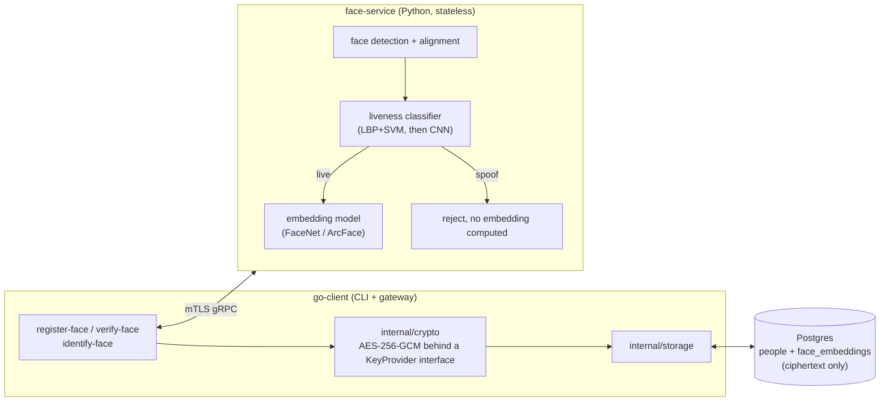

# face-liveness

Face verification that can tell the difference between a live person
and someone trying to get past it with a photo, a printed picture, or a
phone/screen held up to the camera.

## The problem

"Face verification" sounds like one problem. It's two, and they're not
equally hard:

**Face recognition**: is this face the same person as that other face.
A pretrained embedding model turns a detected, aligned face into a
vector, and comparing two faces becomes a cosine similarity check
against a threshold. This part is largely solved territory; there's
integration work here, not much open research.

**Liveness detection** (presentation attack detection, PAD in the
literature): is the thing in front of the camera an actual live human,
not a printed photo, not a screen replaying a video, not a mask. This is
the hard, actively-researched half, and it's the part this project
spends its effort on.

## How the pipeline works

```
capture → detect face → LIVENESS CHECK → (if live) → embedding → compare
                              ↓
                        (if spoof) → reject, recognition never runs
```

Liveness detection gates recognition, not the other way around. A photo
held up to the camera gets rejected before face matching ever sees it.
This ordering is the actual fraud prevention; recognition and liveness
aren't independent features, one blocks the other.

## Architecture



One RPC does detect → liveness check → embedding in a single pass (the
face crop is reused for both the liveness classifier and the embedding
model), returning either a rejection reason or an embedding plus a
liveness confidence score.

Go owns storage, encryption, and orchestration. The Python service is
stateless: it never touches a database, never sees a name or date of
birth, only image bytes and the scores/embeddings it computes from
them. That split is deliberate: it means the matching/liveness models
can be retrained, swapped, or rebenchmarked without touching how
identities are stored, and it means a compromise of the ML service
alone doesn't expose biographic data.

## Metrics

Evaluated on APCER, BPCER, and ACER, not just accuracy:

- **APCER**: attack presentation classification error rate: how often
  a spoof fools the model into thinking it's live. The dangerous
  failure mode.
- **BPCER**: bona fide presentation classification error rate: how
  often a real person gets wrongly rejected. The annoying but safe
  failure mode.
- **ACER**: the average of the two, the headline number.

Accuracy alone hides which of these is happening. A model that always
predicts "live" can post deceptively high accuracy on an imbalanced test
set while its APCER sits at 100%.

## Status

| Milestone                                  | Status       | Notes                                                         |
| ------------------------------------------ | ------------ | ------------------------------------------------------------- |
| M1: LBP + SVM baseline                     | code written | not yet run against real data, needs the NUAA dataset         |
| M2: small CNN from scratch                 | not started  | trained against the same split as M1 for a direct comparison  |
| M3: generalization stretch (CelebA-Spoof)  | not started  | tests whether M2 overfits to NUAA's narrow capture conditions |
| M4: export to ONNX, serve                  | not started  |                                                               |
| M5: Go client + encrypted Postgres storage | not started  |                                                               |
| M6: mTLS between services                  | not started  |                                                               |

Sequenced deliberately: classical technique first, so there's a real
number to compare a neural net against, then a CNN, then a harder
dataset to find out where that CNN's assumptions break.

## Getting started (M1 baseline)

```
cd ml
pip install -r requirements.txt
```

Get the dataset first, see `ml/data/README.md` for which of the three
available formats to use.

```
python src/train_baseline.py
python src/evaluate.py
```

`train_baseline.py` writes the exact train/val/test split it used to
`ml/models/split.json`. `evaluate.py` reads that back instead of
recomputing its own split, so the reported numbers are guaranteed to be
against data the model never saw during training. If it recomputed the
split independently, a later change to the splitting logic could
silently produce a different held-out set than the one training
actually used, and the reported numbers would be meaningless without
anyone noticing.

## Datasets

- **[NUAA Photograph Imposter
  Database](https://parnec.nuaa.edu.cn/_upload/tpl/02/db/731/template731/pages/xtan/NUAAImposterDB_download.html)**,
  small, print-attack-only. Direct download via Google Drive, no
  agreement required. Three formats are offered, use the
  face-detector-output one, see `ml/data/README.md` for details. Used
  for M1/M2.
- **[CelebA-Spoof](https://github.com/ZhangYuanhan-AI/CelebA-Spoof)**,
  larger, covers print, replay, and mask attacks. Distributed via
  Google Drive/Baidu links, sometimes behind a request form. Used for
  M3.

## Tech stack

- **Python**: face detection/alignment, liveness classifier
  (scikit-learn for M1, PyTorch for M2+), embedding model, gRPC serving
- **Go**: CLI, storage, encryption, orchestration
- **Postgres**: encrypted face embeddings, kept in a separate table
  from biographic data
- **gRPC + mTLS**: service boundary and transport auth between Go and
  Python

## Out of scope

- **Depth/IR-based liveness.** Commercial PAD systems lean on depth/IR
  cameras precisely because RGB-only liveness detection has real, known
  limits, a good enough printed photo or replayed video can still fool
  a single-image classifier. This project is RGB-only by necessity
  (webcam/phone camera); that limitation is stated here rather than
  papered over.
- **Active liveness** (blink/head-turn challenges). Passive, single-image
  liveness only.
- **Multi-modal fusion** (RGB + depth + IR combined), the realistic way
  commercial systems close the gap a single RGB camera can't, and out of
  reach without that hardware.
